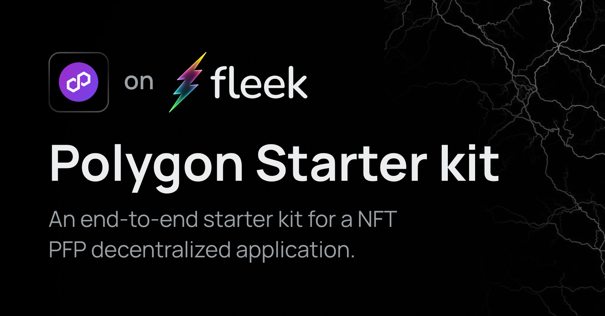

# Polygon + Fleek NFT Starter Kit


This project is meant to give a starte-kit for a NFT PFP decentralized appplication could be structured and deployed on either Polygon PoS (formerly Matic Network) or Polygon Mumbai Testnet, and deploying the Front End to Fleek.
The project comprises of a React frontend provisioned using Create react app but repurposed to use `Vite` instead, and a Hardtat instance that contaisa a NFT smart contract and a few other supporting scripts and files.

## 🚀 Project Structure

Inside of your Polygon NFT project, you'll see the following folders and files:

```
/
├── public/
├── hardhat/
│   ├── artifacts/
│   ├── cache/
│   ├── contracts/
│   └── hardhat.config.ts
├── src/
│   ├── assets/
│   ├── main.tsx
│   ├── App.tsx
│   └── App.css
├── index.html
├── tsconfig.json
├── vite.config.ts
└── package.json
```

To understand more about this project setup, consider exploring Hardhat Documentation and React Documentation.

## 🧞 Commands

All commands are run from the root of the project, from a terminal:

| Command                | Action                                           |
| :--------------------- | :----------------------------------------------- |
| `pnpm install`          | Installs dependencies                            |
| `pnpm run dev`          | Starts local dev server at `localhost:3000`      |
| `pnpm run build`        | Build your production site to `./dist/`          |
| `pnpm run preview`      | Preview your build locally, before deploying     |
| `pnpm run compile`    | Runs hardhat compile and copies contracts `.json` to `src` base folder |

## ⚙️  How to Configure
### 1. Project Setup and Config:
- Install Metamask browser extension and create an account.
- Copy your private key
- Create a .env file inside the hardhat folder with the following key `PRIVATE_KEY = XXXXXXXX`
### 2. Deploy the contract:
- Make changes to the contract
- To deploy to Polygon PoS, run `npx hardhat run scripts/deploy.ts --network matic`
- Run `yarn compile` - this will run the Solidity compiler and generate artifacts that we can use elsewhere in our codebase
- Save the deployment address for when you need to configure the frontend to use the deployed contract.
### 3. NFT PFP:
To use your own NFT PFPs, simply upload them to (IPFS)[https://docs.fleek.xyz/services/ipfs/] and then update the `data.json` file found in the `src/metadata` directory.

## ⚡ How to deploy to Fleek

### 1. Create a `fleek.json` config file:
You can configure this site deployment using [Fleek CLI]() and running:
```
 > fleek sites init
   WARN! Fleek CLI is in beta phase, use it under your own responsibility
   ? Choose one of the existing sites or create a new one. › 
   ❯ Create a new site
```
It will prompt you for a `name`, `dist` directory location & `build command`
- `name`: How you want to name the site
- `dist`: The output directory where the site is located, for this template it's `dist`
- `build command`: Command to build your site, this will be used to deploy the latest version either by CLI or Github Actions

### 2. Deploy the site
After configuiring your `fleek.json` file, you can deployt the site by running

```
fleek sites deploy
```
After running it you will get an output like this:
```
 WARN! Fleek CLI is in beta, use it at your own discretion
 > Success! Deployed!
 > Site IPFS CID: QmSqHfsoqRD7NbG7eQ5c7d7Pdkk71G1mhr4MrQSQZtfSC4

 > You can visit through the gateway:
 > https://ipfs.io/ipfs/QmSqHfsoqRD7NbG7eQ5c7d7Pdkk71G1mhr4MrQSQZtfSC4
 ```

### Extra Features:
- **Contract Changes:** The contract used in this project is not production-ready and users are advised to use Access Control features in Solidity and/or [OpenZepplin](https://github.com/OpenZeppelin/openzeppelin-contracts) libraries to configure appropriate security.
- **Polyscan:** If you want to verify your contracts on Polyscan after deployment, you will need to create an account and generate an API key. Create a [Polyscan](https://polygonscan.com/register) account and Generate an [API Key](https://polygonscan.com/myapikey)

## 👀 Want to learn more?
Feel free to check out these resources to learn more about various libraries and tools used in this project:
- [ERC721](https://eips.ethereum.org/EIPS/eip-721)
- [OpenZeppelin ERC 721 Libraries](https://docs.openzeppelin.com/contracts/4.x/erc721)
- [React Documentation](https://react.dev/)
- [Wagmi](https://wamgi.sh)
- [Chakra UI](https://chakra-ui.com/)

